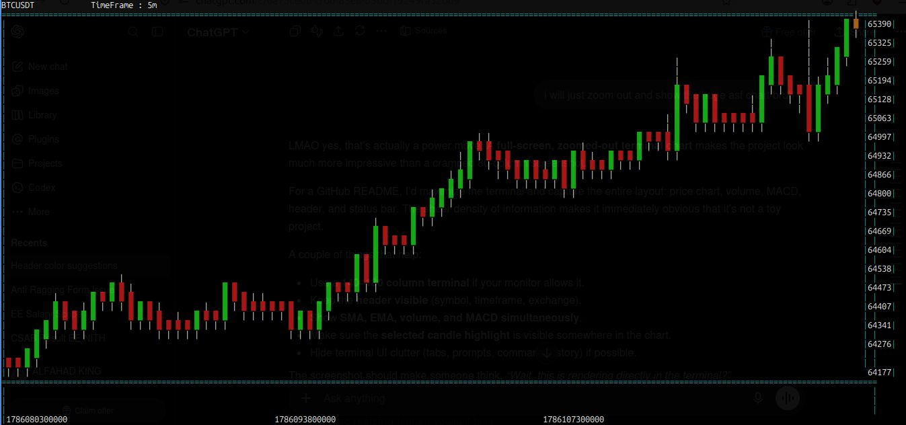
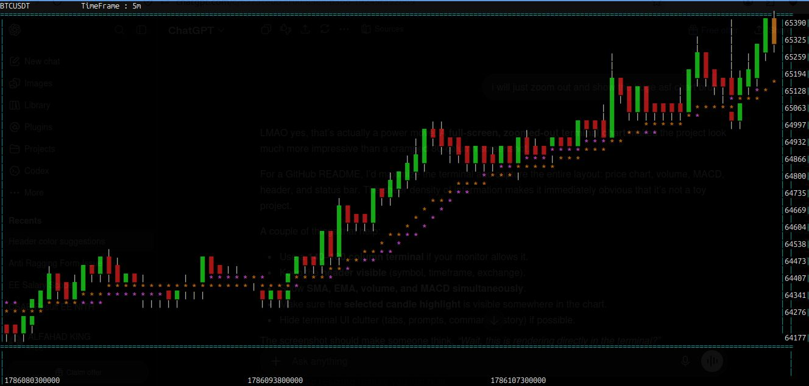
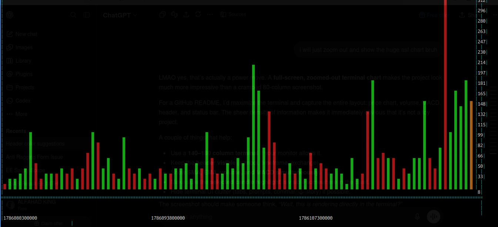
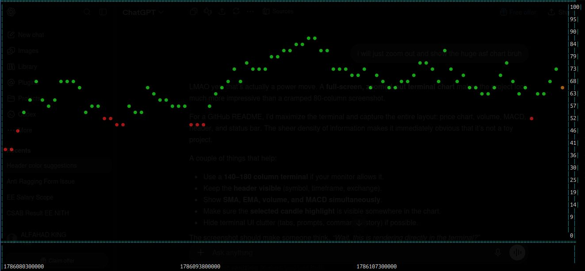
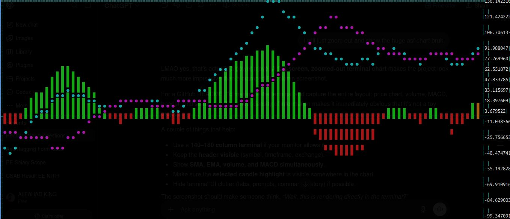

<div align="center">

# 📈 TerminalView

### Lightweight Terminal-Based Financial Charting Engine written in Modern C++

Render historical and live financial charts directly inside your terminal.

**ASCII Graphics • Real-Time Data • Multithreaded • Technical Indicators**

<br>


</div>

---

## 📸 Demo

> **Coming Soon:** Animated GIF showcasing live market updates.

<p align="center">



</p>

---

# ✨ Features

## 📊 Chart Rendering

* 📈 ASCII candlestick charts
* 🔍 Dynamic viewport rendering
* 📉 Automatic price scaling
* 🎯 Interactive candle selection
* ↔️ Horizontal panning
* 📋 Live status bar

---

## 📈 Technical Indicators

* 20 Period Simple Moving Average (SMA)
* 20 Period Exponential Moving Average (EMA)
* Relative Strength Index (RSI-14)
* Moving Average Convergence Divergence (MACD)
* Volume Histogram

---

## ⚡ Live Market Data

* Binance REST API integration
* Automatic live polling
* Live candle refresh
* Automatic new candle detection
* Incremental indicator updates
* Thread-safe shared state

---

# 🏗 Architecture

```text
                 Binance REST API
                        │
                        ▼
                Network Client
                        │
                        ▼
                 JSON Parser
                        │
                        ▼
               Shared Market Data
                 (Mutex Protected)
                  ▲             │
                  │             ▼
             Renderer      Indicators
                  │
                  ▼
             ASCII Terminal
```

---

# ⚙️ Built With

* Modern C++17
* Standard Template Library (STL)
* libcurl
* nlohmann/json
* std::thread
* std::mutex
* Git

---

# 🚀 Getting Started

## Clone Repository

```bash
git clone https://github.com/mohammadalfahd/TerminalView.git
cd TerminalView
```

---

## Build

```bash
mkdir build
cd build

g++ -I../include ../src/*.cpp -lcurl -pthread -o TerminalView
```

---

## Run

```bash
./TerminalView
```

---

# 🎮 Controls

| Key   | Action                 |
| ----- | ---------------------- |
| **A** | Pan chart left         |
| **D** | Pan chart right        |
| **J** | Select previous candle |
| **L** | Select next candle     |
| **S** | Toggle SMA             |
| **E** | Toggle EMA             |
| **V** | Toggle Volume          |
| **M** | Toggle MACD            |
| **R** | Toggle RSI             |
| **Q** | Quit                   |

---

# 🧠 Design Decisions

### Incremental Indicators

Instead of recalculating every technical indicator after each market update, TerminalView updates indicators incrementally whenever possible. This significantly reduces computation during live polling.

---

### Multithreaded Architecture

Rendering and network polling execute on separate threads while sharing synchronized market data through mutex-protected resources.

---

### ASCII Rendering

Every candle, indicator, axis, label, and chart element is manually rendered using ASCII graphics without relying on GUI libraries.

---

### Modular Components

Indicators, renderer, networking, viewport management, and data parsing are implemented as independent modules, making the project easy to extend.

---

# 📁 Project Structure

```text
TerminalView/
│
├── include/
│   ├── indicators/
│   ├── renderer/
│   ├── networking/
│   ├── viewport/
│   └── ...
│
├── src/
├── CSV_files/
├── screenshots/
├── README.md
└── ...
```

---

# 📂 Data Sources

## CSV Import

Expected format:

```text
Date,Open,High,Low,Close,Adj Close,Volume
```

---

## Live Market Data

TerminalView fetches real-time market data from the Binance REST API.

The application automatically distinguishes between:

* Updating the currently forming candle.
* Appending newly completed candles.

---

# ✅ Valid Candle Format

Every candle should satisfy:

```text
High >= Open
High >= Close
Low <= Open
Low <= Close
High >= Low
```

Example:

```text
Open  = 102
High  = 108
Low   = 99
Close = 105
```

---

# 📷 Screenshots

| Main Chart                            | SMA & EMA                   |
| ------------------------------------- | --------------------------- |
|  |  |

| Volume                      | RSI                      |
| --------------------------- | ------------------------ |
|  |  |

| MACD                      |
| ------------------------- |
|  |

---

# 🛣 Roadmap

* [x] Candlestick Rendering
* [x] Dynamic Scaling
* [x] Viewport Navigation
* [x] Live Binance Data
* [x] Multithreaded Rendering
* [x] SMA
* [x] EMA
* [x] RSI
* [x] MACD
* [x] Volume Histogram
* [ ] WebSocket Streaming
* [ ] Bollinger Bands
* [ ] Multiple Timeframes
* [ ] Performance Profiling
* [ ] Configuration System
* [ ] Cross-platform Terminal Support

---

# 📚 What I Learned

Developing TerminalView provided hands-on experience with:

* Modern C++
* Object-Oriented Design
* Multithreading
* Mutex Synchronization
* REST API Integration
* JSON Parsing
* Incremental Algorithms
* Financial Technical Indicators
* Terminal Rendering
* Software Architecture
* Debugging Concurrent Systems

---

# 👨‍💻 About

TerminalView is a personal systems programming project focused on building a lightweight financial charting engine entirely inside the terminal.

Rather than relying on graphical frameworks, every candlestick, indicator, axis, and chart component is rendered manually using ASCII graphics. The project emphasizes clean software architecture, modularity, efficient algorithms, and real-time market visualization.

---

# ⭐ If you like this project...

Consider giving the repository a **star**. It helps others discover the project and motivates future development.

---

# 📜 License

Released for educational and personal use.
